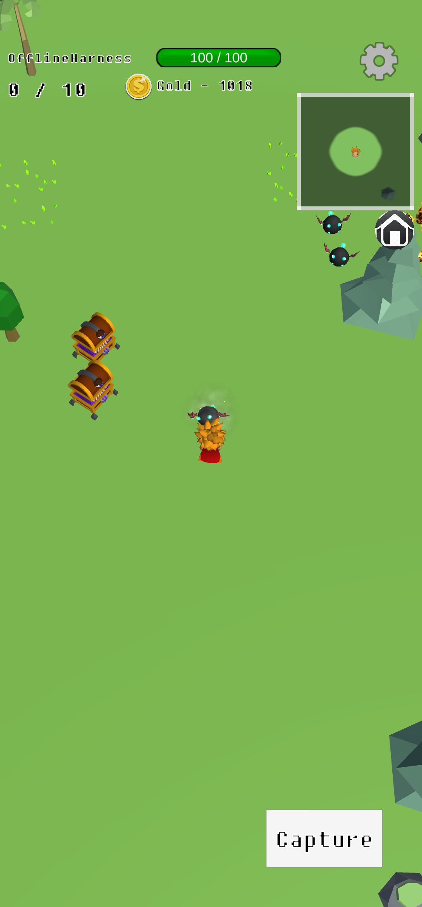
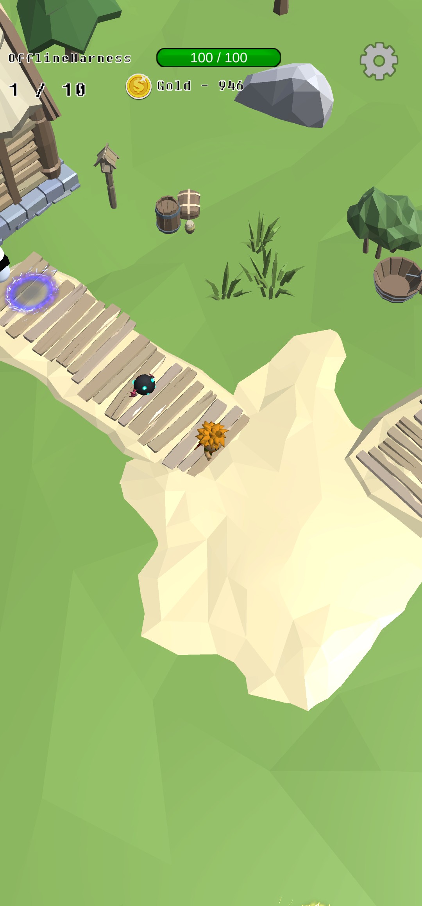
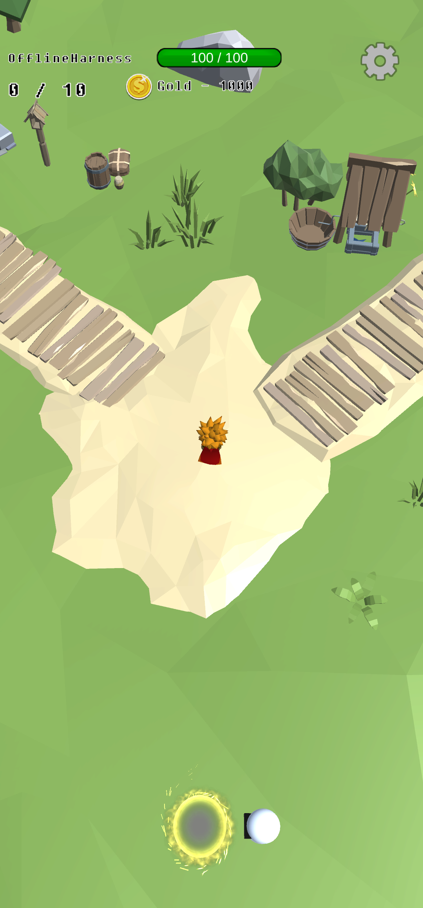

# Monster Tamer

**몬스터를 동료로 모으고, 함께 싸우며 성장하는 Android 3D 게임**

필드에서 몬스터와 전투하고 포획해 동료를 늘려 보세요. 마을에서는 장비와 캐릭터를 관리하고 다음 전투를 준비합니다. Unity로 제작했으며, [WildTamer](https://play.google.com/store/apps/details?id=com.percent.wildtamer&hl=ko)의 플레이를 3D로 재구성한 프로젝트입니다.

**[▶ 기존 플레이 영상 보기](https://github.com/user-attachments/assets/243e5193-5e8f-4966-8b98-c724b62767dd)** · **[Google Play 페이지 열기](https://play.google.com/store/apps/details?id=com.AeDeong.MonsterTamer)** · [개발 시작하기](docs/development.ko.md)

## 플레이

<p align="center">
  
  
  
</p>

격리 촬영 빌드의 실제 게임 화면입니다. 합성 계정으로 촬영하고 진단 표시를 숨겼습니다. 포획 장면은 테스트 대상 생성·무적·포획 가능 여부 고정 기능으로 준비했으며, 일반 전투 난이도나 포획 확률을 보여 주는 자료는 아닙니다. 마을의 Bat 동료는 합성 골드로 게임 내 상점에서 고용했습니다. [이미지 출처·촬영 조건](docs/images/README.md)

| 전투와 포획 | 동료와 성장 | 마을에서 준비 |
| --- | --- | --- |
| 필드를 이동하며 몬스터와 싸우고 포획합니다. | 포획한 몬스터를 동료로 데리고 전투합니다. | 장비와 캐릭터를 관리하며 다음 탐험을 준비합니다. |

## 기존 플레이 영상

[▶ Monster Tamer 플레이 영상 재생](https://github.com/user-attachments/assets/243e5193-5e8f-4966-8b98-c724b62767dd)

기존에 공개한 영상입니다. 현재 복구 중인 개발 빌드와 화면·동작이 다를 수 있습니다.

## 다운로드

**[Google Play에서 Monster Tamer 확인하기](https://play.google.com/store/apps/details?id=com.AeDeong.MonsterTamer)**

기존 공개 스토어 주소입니다. 현재 복구 빌드의 공개 배포와 해당 기기에서의 설치 가능 여부는 아직 확인하지 않았습니다. 이 저장소의 개발·내부 테스트 APK는 일반 다운로드로 제공하지 않습니다.

## 복구 진행 상황

게임 복구와 실제 기기 검증을 진행 중입니다. 아래 결과는 각 문서에 명시된 소스·격리 앱 기준이며 운영 서비스 전체의 검증 완료를 뜻하지 않습니다.

| 확인한 내용 | 근거 |
| --- | --- |
| 실제 포획 → 동료 추가 → 로컬 저장·메모리 서버 반영, 사망 후 복귀 | [게임플레이 검증](docs/revival/gameplay-capture-lifecycle.ko.md) |
| 격리 앱의 무료 테스트 구매, No Ads 저장·동일 설치 복원·재로그인 유지 | [스토어·구매 검증](docs/revival/iap-test-bundle.ko.md) |
| 샘플 광고 보상 후 Home 복귀, 보상 1회·BGM 복귀, 일반 release 광고 요청 차단 | [광고 검증](docs/revival/families-ad-followup-20260914.ko.md) |
| 결제 없는 진행도 검증 앱과 Editor 회귀 400개 통과 | [진행도 검증 준비](docs/revival/progress-only-harness.ko.md) |

실제 서버 진행도 지속 저장, 운영 광고·지역별 동의, 16KB 실행, 개인정보·삭제 운영 연결과 최종 출시 검증은 남아 있습니다. release AAB의 엄격 RELRO 검사 3건 실패와 과거 debug APK 5건 실패를 구분합니다. [전체 실행 목록](docs/revival/recovery-execution-backlog.ko.md)에서 최신 상태를 확인할 수 있습니다.

개발 기준은 **Unity 6000.0.81f1 · Android min API 24 / target API 36 · ARM64**입니다. [도구 잠금](tools/revival/toolchain.json)과 [UPM 잠금](Packages/packages-lock.json)을 따릅니다. **CI/CD는 보류 중**이며 기존 App Center 설정을 보존합니다.

## 시작하기 — Windows PowerShell

필요한 환경은 Git, Python 3.11 이상, Unity **6000.0.81f1**과 Android Build Support(SDK/NDK/OpenJDK), 활성 Unity 라이선스입니다. 구매 에셋은 공개 저장소에 들어 있지 않으므로 권한 있는 원본 또는 비공개 아카이브도 필요합니다.

```powershell
git clone https://github.com/ChoiDaeYoung-94/Tamer.git
Set-Location Tamer

# Editor를 열기 전에 원본 경로를 실제 경로로 바꿉니다.
python tools/revival/restore_assets.py --source 'D:/path/to/authorized-original'
if ($LASTEXITCODE -ne 0) { throw '에셋 복원 실패' }
python tools/revival/restore_assets.py --verify
if ($LASTEXITCODE -ne 0) { throw '에셋 검증 실패' }
python tools/revival/install_cli.py
if ($LASTEXITCODE -ne 0) { throw 'CLI 설치 실패' }

# 이 checkout의 Editor를 닫은 상태에서 실행합니다.
./tools/revival/Run-SdkValidation.ps1
```

성공 시 `Build/revival/Tamer-development.apk`와 `Logs/revival`의 결과를 확인합니다. APK는 별도 앱 ID(`com.AeDeong.MonsterTamer.revival`), debug 서명, 격리 시작 씬을 사용합니다. 기존 운영 앱의 업데이트나 스토어 제출용 빌드가 아닙니다. Library는 checkout마다 새로 생성합니다.

해시 충돌, 설치 경로 변경, 라이선스, Editor 연결과 일상 개발은 [개발 안내](docs/development.ko.md)를 따릅니다. 원본 에셋을 공개 Git/LFS에 추가하거나 복원 manifest를 임의 재생성하지 않습니다.

## 코드와 디렉터리

| 경로 | 역할 |
| --- | --- |
| `Assets/Scripts/Creatures` | Player, Monster, Creature의 이동·전투·동료·버프 |
| `Assets/Scripts/Managers` | 데이터·서버·광고·IAP·씬·풀·사운드 관리자 |
| `Assets/Scripts/Login`, `Main`, `Game`, `SetCharacter`, `NextScene` | 씬별 진입과 화면 흐름 |
| `Assets/Scripts/UI`, `Cameras`, `MiniMap`, `Effects` | 조작 UI, 카메라, 미니맵, 효과 |
| `Assets/Scripts/Editor` | 기존 빌드 코드와 격리 `RevivalBuild` 진입점 |
| `Assets/Scenes`, `Prefabs`, `Resources`, `Settings` | 게임 씬·프리팹·런타임 리소스·렌더링 설정 |
| `Assets/Tests/Editor`, `Assets/Tests/Scenes` | 자동 회귀 테스트와 `RevivalSmoke` 검증 씬 |
| `Assets/ThirdParty` | 선별 공개 SDK와 로컬 서비스 설정 |
| `Assets/ThirdPartyAssets` | 권한 있는 원본에서 복원하는 비공개 게임 에셋 |
| `Packages`, `ProjectSettings` | UPM 버전 잠금과 Unity 프로젝트 설정 |
| `tools/revival`, `docs/revival` | 복원·빌드·APK 검사 도구와 근거 기록 |

기존 게임 씬 흐름은 `Login → SetCharacter/Main → Game`이며 `NextScene`을 전환 씬으로 사용합니다. 로그인/동기화는 Play Games·PlayFab, 결제는 Unity IAP, 광고는 Google Mobile Ads를 사용합니다. 패키지 업그레이드와 실제 서비스 호환성 검증은 단계별 PR로 관리합니다.

## 개발과 기여

[AGENTS.md](AGENTS.md)와 [개발 안내](docs/development.ko.md)를 먼저 읽습니다. 작은 이슈·브랜치·PR에 변경 이유, 재현 입력, 테스트 결과, 미검증 범위를 남기고 검증한 커밋을 병합합니다. `.meta`/GUID, 기존 계정·진행도·No Ads 권한을 보존합니다. 공개 clone 및 외부 PR 제안은 원본 저장소의 push/merge 권한과 다릅니다. 접근 정책은 [#94](https://github.com/ChoiDaeYoung-94/Tamer/issues/94)에서 추적합니다.

주요 개발 문서:

- [최신 복구 실행 목록](docs/revival/recovery-execution-backlog.ko.md)
- [개발·검증·PR 작업 안내](docs/development.ko.md)
- [복원 에셋과 라이선스 범위](docs/revival/dependencies.ko.md)
- [기준 빌드와 검증 근거](docs/revival/baseline.ko.md)
- [복구 계획과 단계별 상태](docs/revival/plan.ko.md)

## 개인정보처리방침

아래는 기존에 게시된 정책입니다. 복구 중인 코드와 Play Console/AdMob/PlayFab의 실제 설정, 보관·삭제 방식 및 Data safety 대조는 남아 있습니다. 이 문서 개편은 그 검증을 완료했다는 의미가 아닙니다.

**AeDeong**는 [Monster Tamer]를 운영합니다. 이 내용는 귀하가 앱을 사용할 때 개인 데이터의 수집, 사용 및 공개에 대한 정책을 알려주기 위해 만들어졌습니다.

## 1. 수집하는 정보

우리는 다음과 같은 유형의 정보를 수집할 수 있습니다:
- 개인 식별 정보 (이름, 이메일 주소 등)
- 사용 데이터 (앱 사용 패턴, 로그 데이터 등)
- 디바이스 정보 (기기 유형, 운영 체제 등)

## 2. 정보 사용 목적

수집된 정보는 다음과 같은 목적으로 사용됩니다:
- 서비스 제공 및 유지
- 사용자 지원 제공
- 사용 패턴 분석을 통한 서비스 개선
- 법적 의무 준수

## 3. 정보 공개

우리는 다음과 같은 경우에 귀하의 정보를 공개할 수 있습니다:
- 법적 요구가 있을 때
- 서비스 제공을 위한 제3자와의 공유 (예: 분석 서비스 제공업체)

## 4. 보안

우리는 귀하의 개인 정보를 보호하기 위해 상업적으로 허용되는 수단을 사용합니다. 그러나, 인터넷을 통한 전송 방법이나 전자 저장 방법은 100% 안전하지 않다는 점을 유의하시기 바랍니다.

## 5. 개인정보 보호정책의 변경

우리는 개인정보 보호정책을 수시로 업데이트할 수 있습니다. 변경 사항은 이 페이지에 게시됩니다. 변경 사항을 정기적으로 확인하는 것이 좋습니다.

## 6. 문의

이 개인정보 보호정책에 대해 질문이나 제안이 있으시면, doeud1410@gmail.com 으로 연락해 주십시오.

이 정책은 2024년 9월 30일부터 유효합니다.
