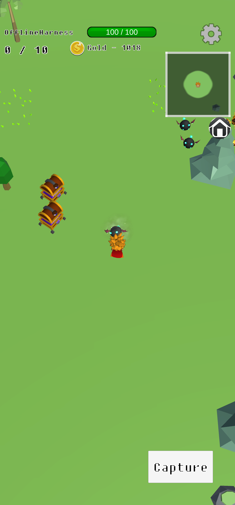
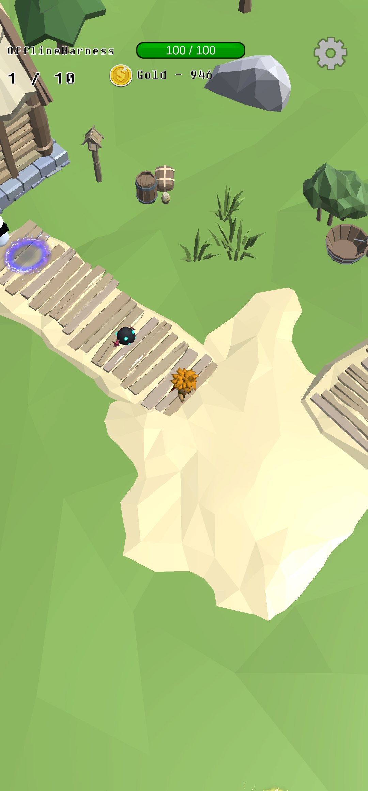
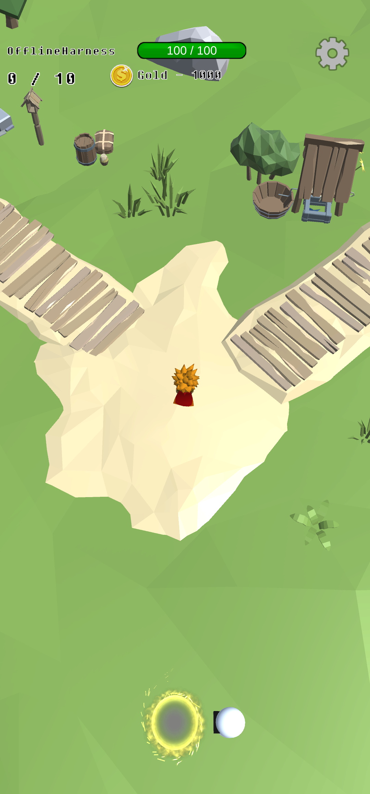

# Monster Tamer

**몬스터를 동료로 모으고, 함께 싸우며 성장하는 Android 3D 게임**

필드에서 몬스터와 전투하고 포획해 동료를 늘려 보세요. 마을에서는 장비와 캐릭터를 관리하고 다음 전투를 준비합니다. Unity로 제작했으며, [WildTamer](https://play.google.com/store/apps/details?id=com.percent.wildtamer&hl=ko)의 플레이를 3D로 재구성한 프로젝트입니다.

**[▶ 기존 플레이 영상 보기](https://github.com/user-attachments/assets/243e5193-5e8f-4966-8b98-c724b62767dd)** · **[Google Play 페이지 열기](https://play.google.com/store/apps/details?id=com.AeDeong.MonsterTamer)** · [개발 시작하기](docs/development.ko.md)

**[앱 삭제 후에도 계정 및 관련 데이터 삭제 요청하기](docs/account-deletion.ko.md)** — Monster Tamer 이용자는 기존 문의 이메일로 삭제를 요청할 수 있습니다.

## 플레이

<p align="center">
  
  
  
</p>

테스트 환경에서 촬영한 실제 게임 화면입니다. [촬영 조건·출처](docs/images/README.md)

| 전투와 포획 | 동료와 성장 | 마을에서 준비 |
| --- | --- | --- |
| 필드를 이동하며 몬스터와 싸우고 포획합니다. | 포획한 몬스터를 동료로 데리고 전투합니다. | 장비와 캐릭터를 관리하며 다음 탐험을 준비합니다. |

## 기존 플레이 영상

[▶ Monster Tamer 플레이 영상 재생](https://github.com/user-attachments/assets/243e5193-5e8f-4966-8b98-c724b62767dd)

기존에 공개한 영상입니다. 현재 복구 중인 개발 빌드와 화면·동작이 다를 수 있습니다.

## 다운로드

**[Google Play에서 Monster Tamer 확인하기](https://play.google.com/store/apps/details?id=com.AeDeong.MonsterTamer)**

기존 공개 스토어 주소입니다. 현재 복구 빌드의 공개 배포와 해당 기기에서의 설치 가능 여부는 아직 확인하지 않았습니다. 이 저장소의 개발·내부 테스트 APK는 일반 다운로드로 제공하지 않습니다.

## 복구 진행 상황

게임 복구와 실제 기기 검증을 진행 중입니다. 아래 결과는 각 문서에 명시된 소스·격리 앱 기준이며 운영 서비스 전체의 검증 완료를 뜻하지 않습니다.

| 확인한 내용 | 근거 |
| --- | --- |
| 실제 포획 → 동료 추가 → 로컬 저장·메모리 서버 반영, 사망 후 복귀 | [게임플레이 검증](docs/revival/gameplay-capture-lifecycle.ko.md) |
| 격리 앱의 무료 테스트 구매, No Ads 저장·동일 설치 복원·재로그인 유지 | [스토어·구매 검증](docs/revival/iap-test-bundle.ko.md) |
| 샘플 광고 보상 후 Home 복귀, 보상 1회·BGM 복귀, 일반 release 광고 요청 차단 | [광고 검증](docs/revival/families-ad-followup-20260914.ko.md) |
| 결제 없는 진행도 검증 앱과 Editor 회귀 400개 통과 | [진행도 검증 준비](docs/revival/progress-only-harness.ko.md) |

실제 서버 진행도 지속 저장, 운영 광고·지역별 동의, 16KB 실행, 개인정보·삭제 운영 연결과 최종 출시 검증은 남아 있습니다. release AAB의 엄격 RELRO 검사 3건 실패와 과거 debug APK 5건 실패를 구분합니다. [전체 실행 목록](docs/revival/recovery-execution-backlog.ko.md)에서 최신 상태를 확인할 수 있습니다.

개발 기준은 **Unity 6000.0.81f1 · Android min API 24 / target API 36 · ARM64**입니다. [도구 잠금](tools/revival/toolchain.json)과 [UPM 잠금](Packages/packages-lock.json)을 따릅니다. **CI/CD는 보류 중**이며 기존 App Center 설정을 보존합니다.

## 시작하기 — Windows PowerShell

필요한 환경은 Git, Python 3.11 이상, Unity **6000.0.81f1**과 Android Build Support(SDK/NDK/OpenJDK), 활성 Unity 라이선스입니다. 구매 에셋은 공개 저장소에 들어 있지 않으므로 권한 있는 원본 또는 비공개 아카이브도 필요합니다.

```powershell
git clone https://github.com/ChoiDaeYoung-94/Tamer.git
Set-Location Tamer

# Editor를 열기 전에 원본 경로를 실제 경로로 바꿉니다.
python tools/revival/restore_assets.py --source 'D:/path/to/authorized-original'
if ($LASTEXITCODE -ne 0) { throw '에셋 복원 실패' }
python tools/revival/restore_assets.py --verify
if ($LASTEXITCODE -ne 0) { throw '에셋 검증 실패' }
python tools/revival/install_cli.py
if ($LASTEXITCODE -ne 0) { throw 'CLI 설치 실패' }

# 이 checkout의 Editor를 닫은 상태에서 실행합니다.
./tools/revival/Run-SdkValidation.ps1
```

성공 시 `Build/revival/Tamer-development.apk`와 `Logs/revival`의 결과를 확인합니다. APK는 별도 앱 ID(`com.AeDeong.MonsterTamer.revival`), debug 서명, 격리 시작 씬을 사용합니다. 기존 운영 앱의 업데이트나 스토어 제출용 빌드가 아닙니다. Library는 checkout마다 새로 생성합니다.

해시 충돌, 설치 경로 변경, 라이선스, Editor 연결과 일상 개발은 [개발 안내](docs/development.ko.md)를 따릅니다. 원본 에셋을 공개 Git/LFS에 추가하거나 복원 manifest를 임의 재생성하지 않습니다.

## 코드와 디렉터리

| 경로 | 역할 |
| --- | --- |
| `Assets/Scripts/Creatures` | Player, Monster, Creature의 이동·전투·동료·버프 |
| `Assets/Scripts/Managers` | 데이터·서버·광고·IAP·씬·풀·사운드 관리자 |
| `Assets/Scripts/Login`, `Main`, `Game`, `SetCharacter`, `NextScene` | 씬별 진입과 화면 흐름 |
| `Assets/Scripts/UI`, `Cameras`, `MiniMap`, `Effects` | 조작 UI, 카메라, 미니맵, 효과 |
| `Assets/Scripts/Editor` | 기존 빌드 코드와 격리 `RevivalBuild` 진입점 |
| `Assets/Scenes`, `Prefabs`, `Resources`, `Settings` | 게임 씬·프리팹·런타임 리소스·렌더링 설정 |
| `Assets/Tests/Editor`, `Assets/Tests/Scenes` | 자동 회귀 테스트와 `RevivalSmoke` 검증 씬 |
| `Assets/ThirdParty` | 선별 공개 SDK와 로컬 서비스 설정 |
| `Assets/ThirdPartyAssets` | 권한 있는 원본에서 복원하는 비공개 게임 에셋 |
| `Packages`, `ProjectSettings` | UPM 버전 잠금과 Unity 프로젝트 설정 |
| `tools/revival`, `docs/revival` | 복원·빌드·APK 검사 도구와 근거 기록 |

기존 게임 씬 흐름은 `Login → SetCharacter/Main → Game`이며 `NextScene`을 전환 씬으로 사용합니다. 로그인/동기화는 Play Games·PlayFab, 결제는 Unity IAP, 광고는 Google Mobile Ads를 사용합니다. 패키지 업그레이드와 실제 서비스 호환성 검증은 단계별 PR로 관리합니다.

## 개발과 기여

[AGENTS.md](AGENTS.md)와 [개발 안내](docs/development.ko.md)를 먼저 읽습니다. 작은 이슈·브랜치·PR에 변경 이유, 재현 입력, 테스트 결과, 미검증 범위를 남기고 검증한 커밋을 병합합니다. `.meta`/GUID, 기존 계정·진행도·No Ads 권한을 보존합니다. 공개 clone 및 외부 PR 제안은 원본 저장소의 push/merge 권한과 다릅니다. 접근 정책은 [#94](https://github.com/ChoiDaeYoung-94/Tamer/issues/94)에서 추적합니다.

주요 개발 문서:

- [최신 복구 실행 목록](docs/revival/recovery-execution-backlog.ko.md)
- [개발·검증·PR 작업 안내](docs/development.ko.md)
- [복원 에셋과 라이선스 범위](docs/revival/dependencies.ko.md)
- [기준 빌드와 검증 근거](docs/revival/baseline.ko.md)
- [복구 계획과 단계별 상태](docs/revival/plan.ko.md)

## 개인정보처리방침

**AeDeong**는 **Monster Tamer**를 운영합니다. 이 방침은 게임 이용, 계정·진행도 저장, 구매·광고 및 문의 과정에서 처리되는 정보를 설명합니다. 개인정보처리방침은 기존의 이 페이지에서 계속 제공합니다.

Google Play에서 제공 중인 앱과 준비 중인 새 버전은 기능과 SDK가 다를 수 있습니다. 새 버전에서 광고 요청을 차단한다고 해서 제공 중인 앱이나 로그인·구매·SDK의 모든 정보 처리가 중단되는 것은 아닙니다. 새 버전의 지역별 광고 동의와 삭제 운영 검증은 진행 중이며, 준비 기능을 이미 제공하거나 검증 완료한 기능으로 안내하지 않습니다.

### 1. 처리하는 정보와 목적

게임은 계정과 진행도를 서버에 전송하는 경로가 있으므로 **개인정보를 전혀 수집하지 않는 앱은 아닙니다.** 사용하는 로그인 방식과 기능에 따라 처리 항목이 달라집니다.

| 구분 | 정보와 이용 목적 |
| --- | --- |
| 로그인·계정 | 게임 계정 ID, Google Play Games 인증에 필요한 정보 또는 기기·사용자 지정 로그인 식별자를 계정 연결과 진행도 로딩에 사용합니다. 기기 로그인에는 운영체제·기기 모델 정보가 포함될 수 있습니다. |
| 프로필·게임 진행 | 이용자가 정한 닉네임, 캐릭터·튜토리얼·동료·장비·게임 재화·보상 상태 등을 기기와 PlayFab에 저장하여 게임을 제공하고 진행도를 유지합니다. 닉네임은 별칭이며 캐릭터의 성별 선택을 이용자의 실제 성별로 취급하지 않습니다. |
| 구매·권한 복원 | Google Play와 Unity IAP를 통해 상품·거래·구매 또는 복원 상태와 No Ads 권한을 처리합니다. 결제수단 전체 번호를 게임에 입력하도록 요구하지 않습니다. 구매는 선택 기능이지만 기존 구매 조회와 SDK의 진단·구매 이벤트 처리는 새 구매 버튼을 누르는 경우에만 한정되지 않을 수 있습니다. |
| SDK 이용·광고 | 사용 중인 SDK와 설정에 따라 기기·설치·계정 식별자, IP 주소와 IP 기반 대략적 위치, 앱·광고 상호작용, 성능·진단 및 구매 이벤트가 서비스 제공·안정성 개선·분석·광고·부정행위 방지에 사용될 수 있습니다. 광고 미표시나 개인화 거부를 모든 SDK 수집 중단으로 설명하지 않습니다. |
| 지원·삭제 문의 | 이메일로 보내신 회신 주소, 문의 내용과 계정 소유 확인에 필요한 최소 자료를 문의 응답 및 삭제 요청 처리에 사용합니다. 게임 로그인에서 이용자의 실제 이메일 주소를 직접 입력받는 경로와 외부 지원 이메일 처리는 구분합니다. |

현재 확인한 게임 코드에서는 실명·주소·전화번호·연락처·녹음·사진·정밀 위치를 게임 기능을 위해 입력받는 경로를 확인하지 않았습니다. 스토어와 각 SDK가 자체 서비스에서 처리하는 정보는 별도이며, 위 설명을 모든 제공 버전과 공급자의 처리 항목이 없다는 보장으로 사용하지 않습니다.

### 2. 함께 사용하는 서비스

다음 서비스가 해당 기능에 필요한 정보를 처리합니다. 서비스 제공을 대신하는 처리와 공급자가 자체 서비스·광고·진단 목적으로 처리하는 범위를 구분하며, 공급자의 정책과 이용자가 사용하는 버전·설정에 따라 달라질 수 있습니다.

- **Microsoft PlayFab:** 게임 계정, 닉네임과 진행도 저장·조회 및 계정 삭제 처리에 사용합니다. [Microsoft 개인정보처리방침](https://www.microsoft.com/ko-kr/privacy/privacystatement) · [PlayFab 플레이어 데이터 안내](https://learn.microsoft.com/en-us/xbox/playfab/player-progression/player-data/)
- **Google Play Games·Google Play:** 게임 인증, 스토어 구매·복원과 Google 서비스의 계정·진단 정보를 처리합니다. 게임은 Google 계정이나 다른 게임의 모든 데이터를 삭제하거나 읽을 권한을 갖는 것은 아닙니다. [Google 개인정보처리방침](https://policies.google.com/privacy?hl=ko) · [Play Games 데이터 처리 안내](https://developer.android.com/games/pgs/data-collection)
- **Unity IAP:** 구매 처리·권한 복원과 SDK의 구매·진단 정보를 처리합니다. 선택적인 광고·분석 목적 설정과 구매 기능에 필요한 처리를 구분합니다. [Unity 개인정보처리방침](https://unity.com/legal/privacy-policy) · [Unity IAP 데이터 처리 안내](https://docs.unity.com/en-us/iap/privacy-and-consent/google-play-data-safety)
- **Google AdMob·User Messaging Platform(UMP):** 광고 및 광고 개인정보 선택을 처리하는 서비스입니다. 광고 SDK는 광고·분석·부정행위 방지를 위해 식별자·IP·상호작용·진단 정보를 처리할 수 있습니다. 실제 사용하는 광고 파트너와 선택 항목은 제공되는 개인정보 메시지에서 확인해야 하며, 새 버전의 메시지는 아직 준비 단계입니다. [광고 SDK 데이터 처리 안내](https://developers.google.com/admob/android/privacy/play-data-disclosure) · [UMP 개인정보 선택 안내](https://developers.google.com/admob/unity/privacy)

공급자 안내는 해당 SDK의 설명입니다. 최신 SDK의 전체 목록을 사용 중인 모든 버전의 확정 수집 항목으로 그대로 적용하지 않습니다. 게임 계정 삭제만으로 Google·Unity·Microsoft가 다른 서비스에서 처리하는 정보를 모두 삭제할 수는 없습니다.

### 3. 연령 선택과 광고 개인정보 선택

준비 중인 새 버전은 생년월일 대신 연령 구간 또는 응답하지 않음을 선택하는 방식을 사용합니다. 선택한 구간 자체는 기기 내 설정에 저장하며 게임 계정·진행 데이터로 서버에 업로드하지 않습니다. 광고 동의 기능을 사용하는 경우에는 이 선택에 따른 아동·청소년 처리 신호와 동의 요청·선택 상태를 광고 SDK에 전달할 수 있습니다. **기기 내 연령 저장과 SDK로 보내는 처리 신호는 서로 다릅니다.**

연령 구간만으로 거주 지역의 법적 동의 연령이나 보호자 동의를 확인했다고 판단하지 않습니다. 새 버전의 지역·연령 조건과 운영 광고는 검토가 끝날 때까지 차단하며, 이 상태를 기존 제공 앱에도 동일하게 적용됐다고 설명하지 않습니다.

지역과 제공 기능에 따라 개인정보 메시지에서 허용·거부 등 선택을 안내합니다. SDK가 개인정보 옵션을 요구하는 경우 앱의 광고 개인정보 옵션에서 다시 선택할 수 있도록 준비하고 있습니다. 메시지 초안·미리보기는 실제 이용자에게 게시된 동의 화면이나 운영 광고 활성화를 뜻하지 않습니다. 연령 미응답, 비개인화 광고, No Ads 구매가 로그인·구매·SDK의 모든 처리를 중단하는 것은 아닙니다.

### 4. 보관과 삭제 요청

계정과 진행 정보는 게임 계정·진행 저장 기능에 사용합니다. 계정 삭제 처리 후 별도 보관용 게임 계정·진행 사본을 만들지 않는 원칙을 적용하며, 요청 처리에 필요한 이메일 원문과 소유 확인 자료는 처리 종료 후 삭제하고 별도로 보관하지 않습니다. 서버·백업·처리 기록·메일 서비스와 공급자에 실제로 남는 자료의 범위와 기간은 운영 경로를 확인한 뒤 안내합니다. 확인되지 않은 기간을 임의로 정하거나 모든 정보가 즉시 삭제된다고 약속하지 않습니다.

앱을 삭제했거나 실행할 수 없어도 **[doeud1410@gmail.com](mailto:doeud1410@gmail.com)**으로 Monster Tamer 계정 및 관련 데이터 삭제를 요청하실 수 있습니다. 앱을 재설치할 필요는 없습니다. [삭제 요청 방법·소유 확인·대상과 제한](docs/account-deletion.ko.md)을 확인해 주세요. **이메일 발송, 요청 접수와 삭제 완료는 서로 다릅니다.** 확인되지 않은 다른 사람의 계정이나 파일을 임의로 삭제하지 않습니다.

Google 계정, 다른 게임의 계정과 Google Play 구매 기록 자체는 이 게임의 삭제 대상이 아닙니다. 기존 No Ads 권한과 구매 복원 경로를 보존하며, 게임 계정 삭제 후 새 계정에서의 실제 구매 복원은 아직 확인되지 않았습니다. 다른 기기나 접근할 수 없는 기기에 남은 파일이 이메일 요청만으로 원격 삭제되는 것은 아닙니다. 공급자의 계정·데이터 관리 방법은 각 서비스의 안내를 함께 확인해 주세요.

### 5. 보안

현재 확인한 기본 PlayFab 연결은 HTTPS를 사용하며 Google·Unity의 위 SDK 안내도 전송 암호화를 설명합니다. 이는 최종 앱의 모든 SDK·설정·전송 경로를 검증했다는 의미가 아니며 기기 내 저장 파일의 암호화와도 구분합니다. 인터넷 전송과 전자 저장의 완전한 안전을 보장할 수는 없습니다.

문의나 삭제 요청에 비밀번호, 일회용 인증번호, 로그인 토큰, 신분증 또는 결제수단 전체 정보를 보내지 마세요. 계정 소유 확인에 필요한 자료는 담당자가 안내하며 공개 저장소 이슈에 요청 자료를 게시하지 마세요.

### 6. 변경 및 문의

처리 항목이나 기능이 변경되면 기존의 이 페이지에 내용을 갱신합니다. 최초 정책 게시일은 **2024년 9월 30일**이며, 이 본문 보완안은 **2026년 9월 28일** 기준으로 확인한 게임 코드와 공급자 안내를 반영합니다. 새 버전의 운영 동의·삭제·Data safety 제출 완료를 뜻하지 않습니다.

운영자: **AeDeong** · 게임: **Monster Tamer** · 개인정보 및 삭제 문의: **[doeud1410@gmail.com](mailto:doeud1410@gmail.com)**
